# Chương 3: Giới Thiệu Về Những Cuộc Đua

## 3.1 AWS DeepRacer League

### 3.1.1 Giới thiệu

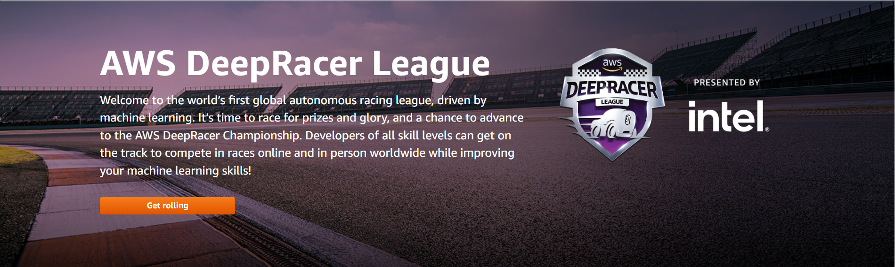

- AWS DeepRacer League là một thành phần quan trọng của AWS DeepRacer. Giải AWS DeepRacer nhằm mục đích thúc đẩy học tập cộng đồng và khám phá cộng tác thông qua chia sẻ và cạnh tranh.
- Với AWS DeepRacer League, bạn có thể có nỗ lực phát triển của mình so với các nhà phát triển AWS DeepRacer khác trong một sự kiện đua vật lý hoặc ảo. Bạn không chỉ có cơ hội giành được giải thưởng, bạn còn có một cách để đo lường mô hình học tăng cường của mình. Bạn có thể tạo cơ hội để chia sẻ những hiểu biết của mình với những người tham gia khác, để học hỏi lẫn nhau và truyền cảm hứng cho nhau.

### 3.1.2 Thể thức thi đấu

- Tham gia Giải đua AWS DeepRacer từ bất cứ nơi nào trên thế giới thông qua bảng điều khiển AWS DeepRacer và thử thách kỹ năng của bạn trên các đường đua ảo hàng tháng. Tham gia đua để giành giải thưởng, vinh quang và cơ hội thi đấu tại Cúp vô địch AWS DeepRacer. 
- Nhà phát triển Thông tin mới cho năm 2021 sẽ bắt đầu từ vòng Open Division của giải đấu. Mỗi tháng, 10% những người đứng đầu trong vòng Open Division sẽ tiến vào vòng Pro Division trong tháng tiếp theo. 

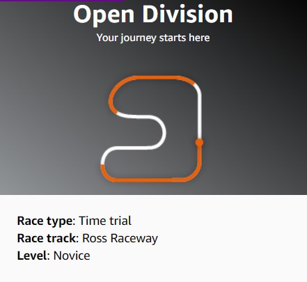

- 16 tay đua dẫn đầu ở cuối cuộc đua Pro Division cuối mỗi tháng sẽ đủ điều kiện tham gia Pro Finale. Tại vòng này, họ sẽ đua trực tiếp để xác định người chiến thắng của tháng đó. 

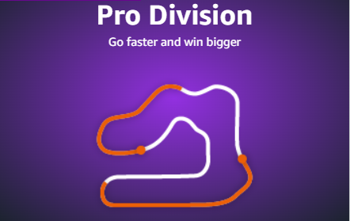

- 10 người dẫn đầu ở vòng Pro Finale sẽ nhận được thiết bị AWS DeepRacer Evo, trong đó 3 người dẫn đầu sẽ đủ điều kiện nhận chuyến đi được chi trả chi phí để tham gia thi đấu Cúp vô địch AWS DeepRacer tại re:Invent.

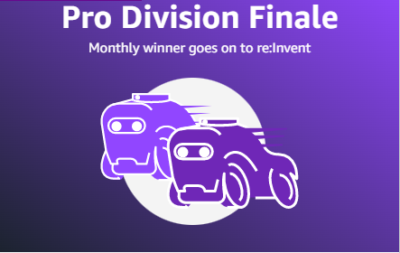

### 3.1.3 Cách tham gia

- Ở trang chính của AWS DeepRacer, chọn mục **Your models** ở bên trái:

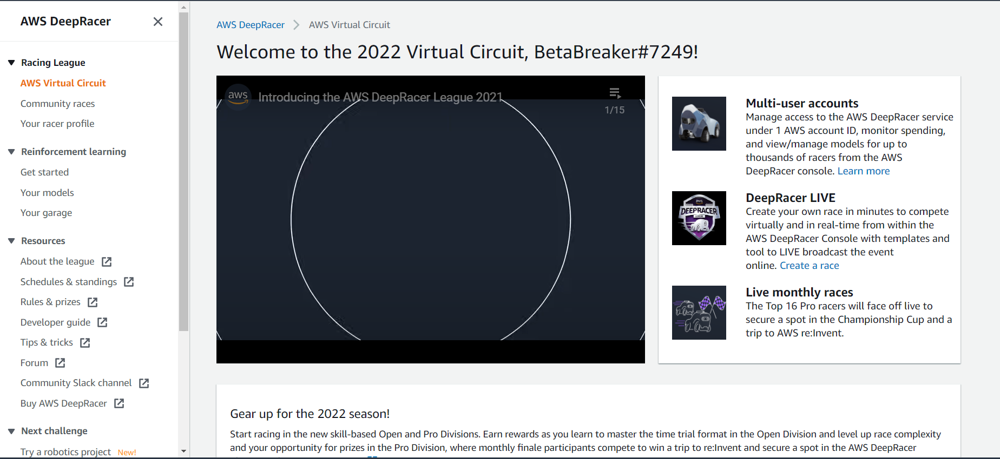

- Chọn một model mà bạn cảm thấy phù hợp:

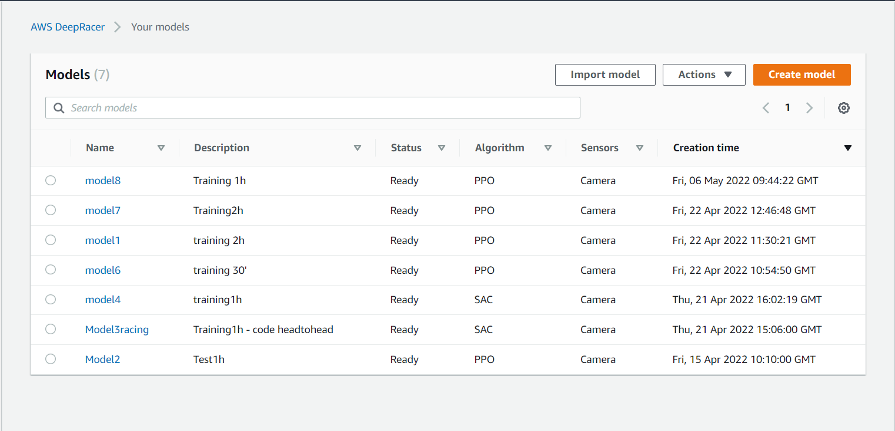

- Chọn **Submit to virtual race**:

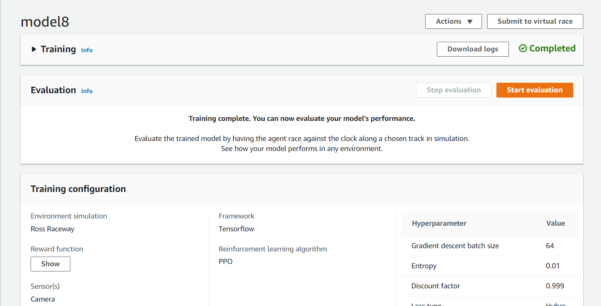

- Bảng cuộc đua Open Division sẽ hiện ra:

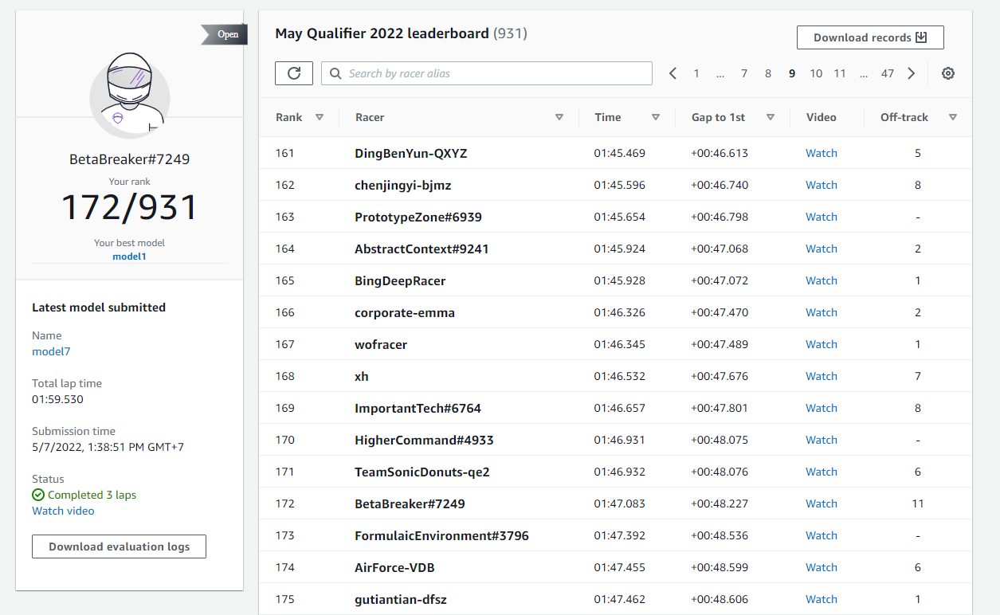

## 3.2 Giới thiệu về AWS DeepRacer Student League

### 3.2.1 Giới thiệu

- AWS DeepRacer Student: do Intel tổ chức, cho phép các học sinh trung học và đại học trên toàn cầu phát triển các kỹ năng ML(Machine Learning) của họ trong một giải đua tự trị thú vị, thực hành. 
- Với AWS DeepRacer Student, bất kỳ học sinh nào từ 16 tuổi trở lên đều có thể tận dụng 20 giờ tài liệu giáo dục ML và 10 giờ đào tạo mô hình(Training Model) hàng tháng tính toán các nguồn lực để nâng cao kỹ năng ML. Hãy thử nghiệm các kỹ năng mới tìm thấy của bạn trong các cuộc thi hàng tháng để có cơ hội giành được các giải thưởng như học bổng, thiết bị và trải nghiệm bằng cách trở thành một trong những tay đua hàng đầu trong các cuộc thi toàn cầu diễn ra hàng tháng.

### 3.2.2 Thể thức thi đấu và giải thưởng

- Đua hàng tháng trong các cuộc thi ảo

- Học sinh có thể cạnh tranh hàng tháng để giành được các giải thưởng như thiết bị AWS DeepRacer và quỹ áp dụng cho học phí sau trung học. Vào cuối mỗi tháng, 2 tay đua hàng đầu trên bảng xếp hạng sẽ tiến đến Vòng chung kết Giải AWS DeepRacer Student League.

      Vị trí thứ nhất - $ 1,000 USD cho học phí

      Vị trí thứ 2 - $ 500 USD cho học phí

      Vị trí thứ 1 - 8 - Xe AWS DeepRacer

- Tiến tới Vòng chung kết Liên đoàn Sinh viên

- Các thí sinh lọt vào vòng chung kết hàng tháng sẽ cạnh tranh vào tháng 10 trong Vòng chung kết của Liên đoàn Sinh viên. 3 người chiến thắng hàng đầu từ Vòng chung kết sẽ giành được quỹ học phí và một chuyến tham dự Giải vô địch DeepRacer League tại AWS re: Invent 2022 ở Las Vegas, NV Hoa Kỳ.

      Vị trí thứ nhất - $ 5.000 USD cho học phí

      Vị trí thứ 2 - $ 2.500 USD cho học phí

      Vị trí thứ 3 - $ 1,000 USD cho học phí

      Vị trí thứ 4 - 6 - $ 500 USD cho học phí

- Đăng ký Chương trình học bổng AI & ML

- Ngoài các giải thưởng DeepRacer Student League, những sinh viên không được phục vụ hoặc có trình độ thấp trong lĩnh vực công nghệ có thể đủ điều kiện tham gia Chương trình học bổng AWS AI & ML với cơ hội kiếm được tới hai trong số 2.500 học bổng miễn phí nano Udacity (trị giá $ 4.000 USD).

### 3.2.3 Cách tham dự

- Nếu chưa có tài khoản thì hãy chọn **Sign up**, ngược lại nếu có rồi thì hãy **Sign in**:

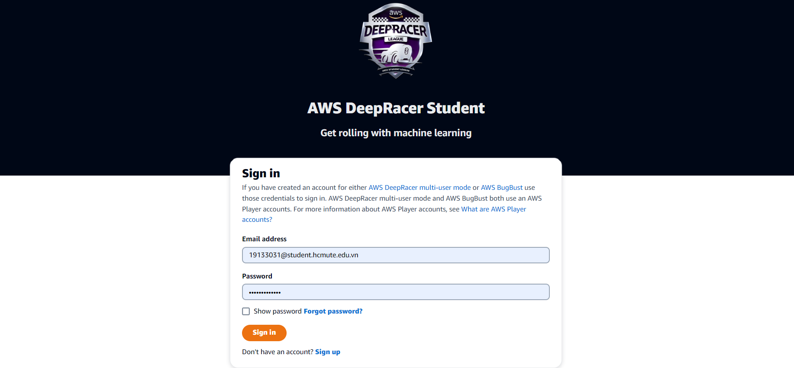

- Sau đó, tạo sẽ bắt đầu **Create models** trong phần **Your models**:

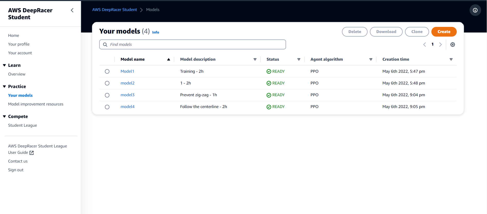

- Vào phần **Home** sau đó chọn **Join race**:

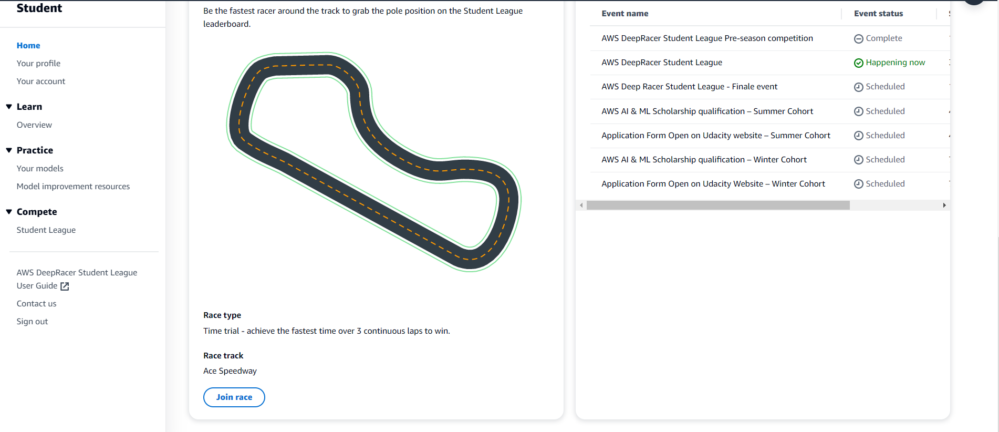

- Vào **Race** --> **Chọn model thích hợp** --> **Enter race**  

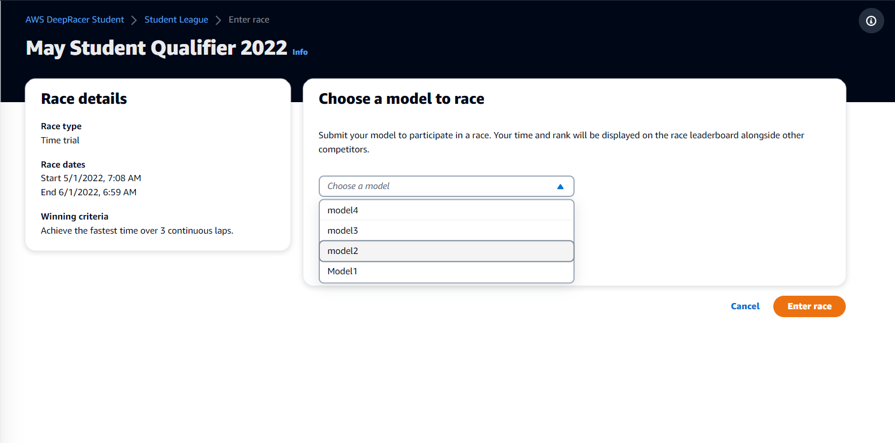

- Bảng cuộc đua AWS DeepRacer Student League sẽ hiện ra:

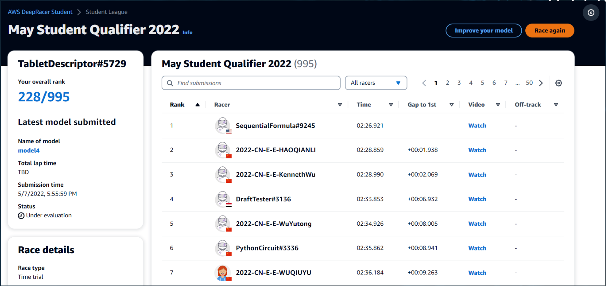

## 3.3 Cách Tạo Đường Đua Cho Riêng Mình

- Ở trang chính của AWS DeepRacer, chọn mục **Community races** ở bên trái --> Chọn nút **Create race**

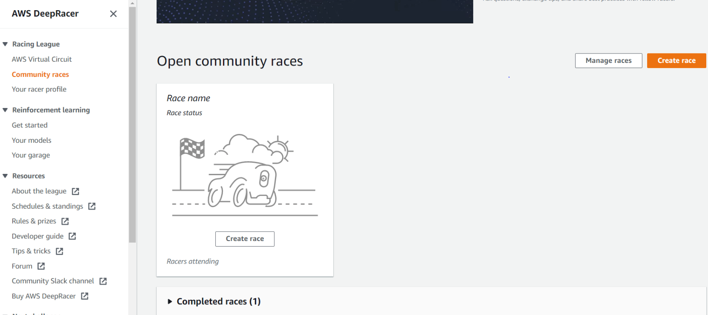

- Chọn format đua và cách thức đua  
Có 3 cách thức đua gồm: **Đua với thời gian**, **Đua với bot** và **Vượt chướng ngại vật**:

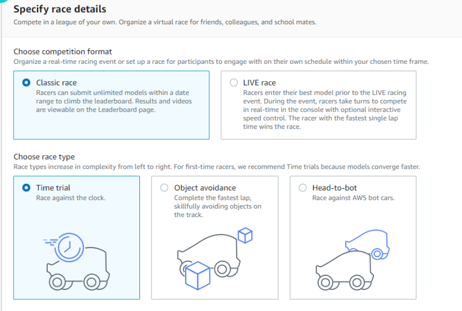

- Đặt tên và chọn ngày cuộc đua bắt đầu và nhấn **Next**

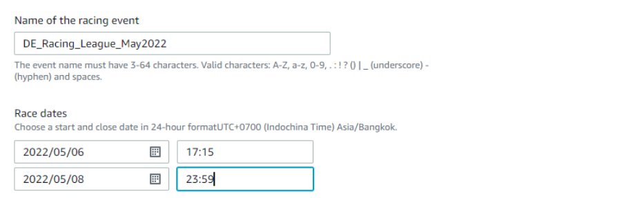

- Chọn đường đua mà mình muốn tạo

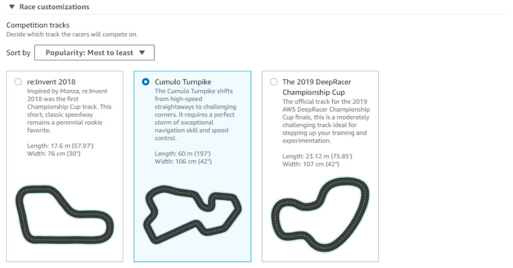

- Chỉnh sửa một vài thông số như điều kiện chiến thắng, số lap và khoảng dừng khi bị lệch khỏi đường đua sau đó nhất **Next**  
Điều kiện chiến thắng gồm Thời gian hoàn thành 1 lap, Thời gian trung bình hoàn thành của 1 lap và Tổng thời gian hoàn thành tất cả lap

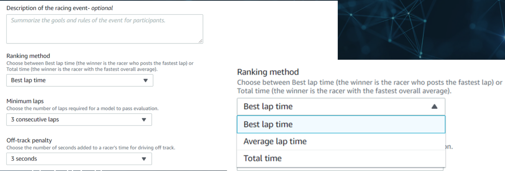

- Bảng review lại đường đua mình đã tạo hiện ra, nhấn **Submit**

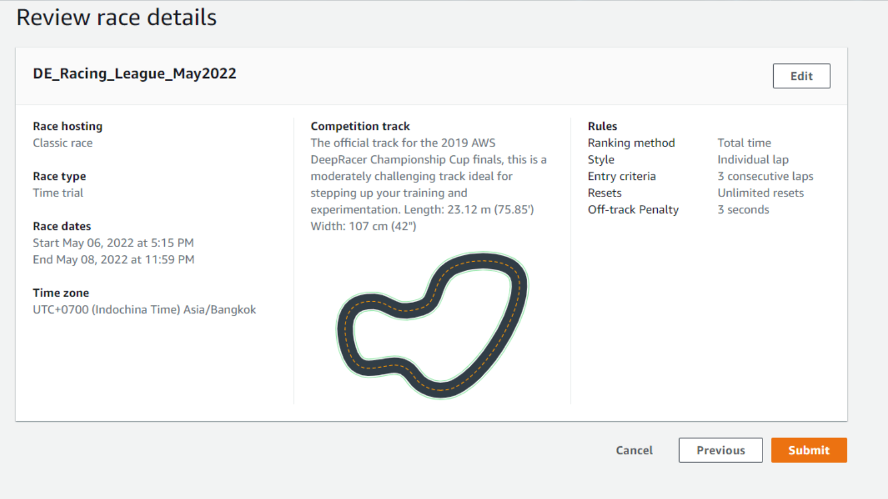

- Một đường dẫn sẽ xuất hiện, ta có thể gửi để mời bạn bè cùng tham gia

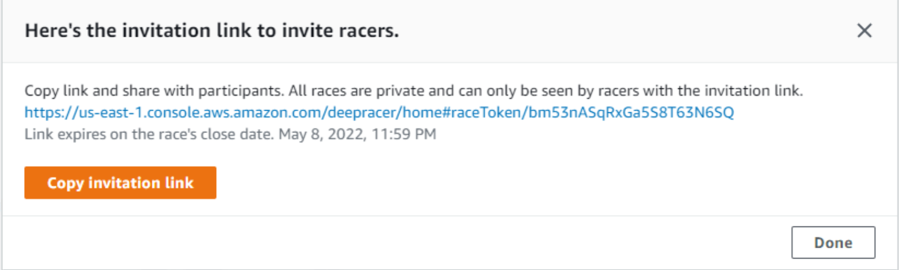
