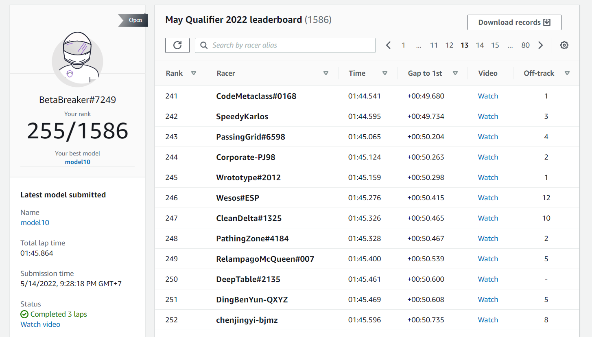

# Chương 4: Thực Nghiệm

## 4.1 Giải Open Division Tháng 4

- Qua tìm hiểu và thực nghiệm, nhóm đã rút ra được một số mô hình phù hợp cho việc huấn luyện và đạt được một thứ hạng không quá thấp trong cuộc đua Open Division Tháng 4:

## 4.2 Giải Open Division Tháng 5

- Qua tìm hiểu và thực nghiệm, nhóm đã rút ra được một số mô hình phù hợp cho việc huấn luyện và đạt được một thứ hạng không quá thấp trong cuộc đua Open Division Tháng 5:

## 4.3 Giải AWS DeepRacer Student League

- Qua tìm hiểu và thực nghiệm, nhóm đã rút ra được một số mô hình phù hợp cho việc huấn luyện và đạt được một thứ hạng không quá thấp trong cuộc đua AWS DeepRacer Student League:

